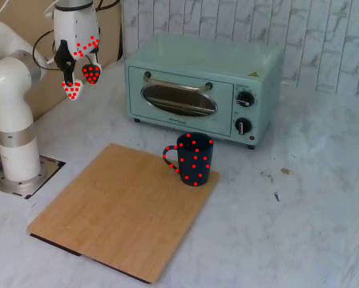

# P3-PO: Prescriptive Point Priors for Visuo-Spatial Generalization of Robot Policies

- This work is forked from https://github.com/siddhanthaldar/BAKU/tree/main. Please refer to the BAKU paper for more information on training etc.

## Installation
- Clone the repository and create a conda environment using the provided `conda_env.yml` file.
```
conda env create -f conda_env.yml
```
- Activate the environment using `conda activate p3po`. Please note that different computers and environments will require different installations for pytorch and the cudatoolkit. We install them with pip install, but make sure that this is compatible with your computer's version of cuda. If it is not you should be fine to just uninstall pytorch and download it as makes sense for your set up.

- You can download and install the submodules and relevant packages by running the setup.sh file. Make sure to run this from the root repository or the models may get installed in the wrong location.
```
./setup.sh
```

## Setting up data
- You can generate data for metaworld by running
```
cd p3po/data_generation
python generate_metaworld.py
```
- You can also use your own data for p3po. Please make sure that the data is in the following format.

## Dataset Structure

- The dataset should be structured as a Python dictionary with the following format:

```
data = {
    "actions": np.ndarray,  # A NumPy array of NumPy arrays where each outer array represents an episode and each inner array contains the actions taken at each step in the episode.
    "observations": [       # A list where each element represents an episode.
        {
            "pixels": np.ndarray,  # A NumPy array representing the pixel data for each step in the episode.
            "features": np.ndarray    # A NumPy array representing the feature data for each step in the episode.
            "depth": np.ndarray    # A NumPy array representing the depth data for each step in the episode.
        },
        ...
    ]
}
```

- You do not need to include specifically "pixels","features" and "depth" as keys if the observation dictionary, but please include necessary observations here.

- Save this data to a pickle file to be used in future steps.

## Labeling the points
- The next thing you will need to do is label your "prescriptive points". We have included a jupyter notebook to do this in the `P3PO/p3po/data_generation` folder.

- Open the label_points notebook. In the first cell you will need to set several variables.

- The first is the path to the image/video you want to label points on. If you want to label an image make sure you set use_video to False. You can also label from a pickle file of the correct format.

- Next you'll need to name your task, remember this name as you'll need to use it later to point the final code towards your labeled points.

- If the image is too small to label accurate points you can set size_multiplier to a larger number, this won't change the final points.

- Once you have set these you can run the all the cells and label points at the bottom. You can do this by clicking on the image. Once you are done please select the Save Images button.

- We have included an image to show you an example of what labeled points may look like. 


- If you find that the tracking is not as good as you would like you can label some additional points on each object as shown below. This will likely improve cotrackers accuracy. Make sure to label these points AFTER you have selected all of the prescriptive points and also you will need to set the number of prescriptive points in the next step.



## Labeling the data
- Now that you have selected your points you can generate your dataset.
  
- Set your path and task name in the config file located at `P3PO/p3po/cfgs/suite/p3po.yaml`. If you labeled additional points in the prior step you will need to set num_points here. If not you can leave this set to -1.
  
- Open the generate_points.py script and finish the 3 TODOs labeled there

```
python generate_points.py
```

## Training P3PO
- Once you have generated your dataset you can train it. Before you do this set your root directory in the main config.yaml file and make sure that the suite/p3po.yaml file is still correct for the environment you wish to train on.

- The following script can be used to train the metaworld assembly task. You can train a different task by replacing assembly here.
```
python train.py agent=baku suite=metaworld dataloader=p3po_metaworld suite.hidden_dim=256 use_proprio=false suite.task.scenes=[TASK_NAME_HERE] eval=true save_train_video=true
```

- You can train an xarm environment using the following script. Make sure the task name is aligned with the name of the dataset.
```
python train.py agent=baku suite=xarm_env dataloader=p3po_xarm suite.task.tasks[TASK_NAME_HERE] suite.hidden_dim=256 use_proprio=false
```

- If you are not using one of our suites you can train a general dataset using.  Make sure the task name is aligned with the name of the dataset.
```
python train.py agent=baku suite=metaworld dataloader=p3po_general suite.task.tasks[TASK_NAME_HERE] suite.hidden_dim=256 use_proprio=false
```

## Evaluating P3PO
- Before you evaluate set your root directory in the config_eval.yaml.

- You can evaluate metaworld tasks with the following command. Change the scene accordingly.

```
python eval.py agent=baku suite=metaworld dataloader=p3po_metaworld suite.task.scenes=[TASK_NAME_HERE] use_proprio=false  suite.hidden_dim=256 bc_weight=/path/to/model
```

- Follow the same patten to evaluate other environments.

- If you want to run on your own environment we include a template in suite/p3po_general. On line 383 there is a TODO where you will need to set env to a custom gym environment. Note that if you wish to use ground truth depth your environment must have a get_depth() method. If you want to use DepthAnything set depth_keys in the config file to an empty list.


